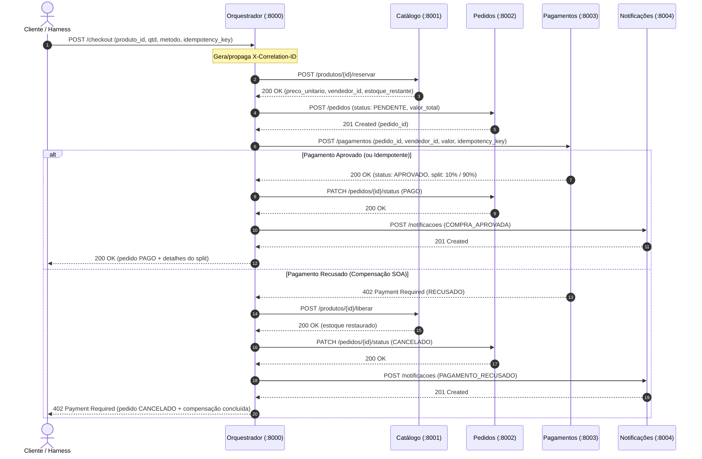

# Diagrama de Sequência — Fluxo Principal e Compensação

```mermaid
sequenceDiagram
    autonumber
    actor C as Cliente / Harness
    participant O as Orquestrador (:8000)
    participant Cat as Catálogo (:8001)
    participant Ped as Pedidos (:8002)
    participant Pag as Pagamentos (:8003)
    participant Not as Notificações (:8004)

    C->>O: POST /checkout (produto_id, qtd, metodo, idempotency_key)
    Note over O: Gera/propaga X-Correlation-ID

    O->>Cat: POST /produtos/{id}/reservar
    Cat-->>O: 200 OK (preco_unitario, vendedor_id, estoque_restante)

    O->>Ped: POST /pedidos (status: PENDENTE, valor_total)
    Ped-->>O: 201 Created (pedido_id)

    O->>Pag: POST /pagamentos (pedido_id, vendedor_id, valor, idempotency_key)
    alt Pagamento Aprovado (ou Idempotente)
        Pag-->>O: 200 OK (status: APROVADO, split: 10% / 90%)
        O->>Ped: PATCH /pedidos/{id}/status (PAGO)
        Ped-->>O: 200 OK
        O->>Not: POST /notificacoes (COMPRA_APROVADA)
        Not-->>O: 201 Created
        O-->>C: 200 OK (pedido PAGO + detalhes do split)
    else Pagamento Recusado (Compensação SOA)
        Pag-->>O: 402 Payment Required (RECUSADO)
        O->>Cat: POST /produtos/{id}/liberar
        Cat-->>O: 200 OK (estoque restaurado)
        O->>Ped: PATCH /pedidos/{id}/status (CANCELADO)
        Ped-->>O: 200 OK
        O->>Not: POST /notificacoes (PAGAMENTO_RECUSADO)
        Not-->>O: 201 Created
        O-->>C: 402 Payment Required (pedido CANCELADO + compensação concluída)
    end
```
